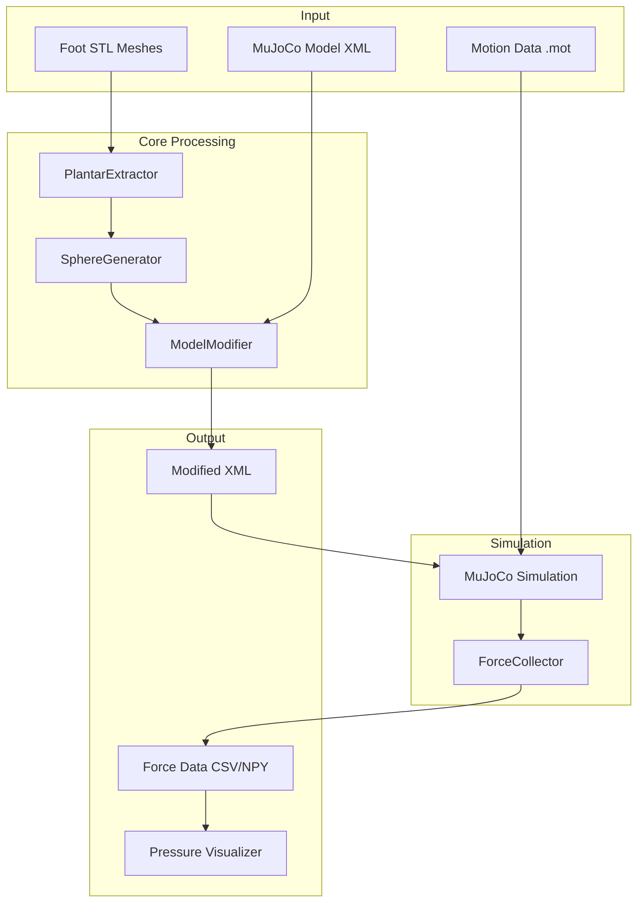

# Design Document: Plantar Pressure Contact Spheres

## Overview

This feature adds dense Hunt-Crossley contact sphere arrays to the foot meshes of MuJoCo musculoskeletal models, enabling synthetic plantar pressure data generation during gait simulation. The system extracts plantar surface vertices from foot STL meshes, distributes ~1000 contact spheres uniformly across each foot, modifies the MuJoCo XML model, and provides tools for recording contact forces and visualizing pressure maps.

## Architecture



## Components and Interfaces

### 1. PlantarExtractor

Extracts plantar (ground-facing) surface vertices from foot mesh geometry.

```python
class PlantarExtractor:
    """Extracts plantar surface vertices from foot mesh."""
    
    def __init__(self, normal_threshold: float = -0.5):
        """
        Args:
            normal_threshold: Minimum Y-component of vertex normal to be 
                            considered plantar (default -0.5 = ~60° from vertical)
        """
        pass
    
    def extract_plantar_vertices(
        self, 
        vertices: np.ndarray, 
        faces: np.ndarray
    ) -> tuple[np.ndarray, np.ndarray]:
        """
        Extract vertices on the plantar surface.
        
        Args:
            vertices: (N, 3) array of mesh vertices
            faces: (M, 3) array of face indices
            
        Returns:
            plantar_vertices: (K, 3) array of plantar surface vertices
            vertex_indices: (K,) array of original vertex indices
        """
        pass
```

### 2. SphereGenerator

Generates uniformly distributed contact sphere positions using Poisson disk sampling.

```python
@dataclass
class SphereConfig:
    """Configuration for contact sphere generation."""
    radius: float = 0.003  # 3mm default
    target_count: int = 1000
    min_spacing: float = 0.004  # Minimum distance between sphere centers
    stiffness: float = 1e6  # Hunt-Crossley stiffness (N/m^3)
    damping: float = 1e3  # Hunt-Crossley damping (N*s/m)
    friction: tuple[float, float] = (0.8, 0.6)  # (static, dynamic)

class SphereGenerator:
    """Generates uniformly distributed contact spheres on plantar surface."""
    
    def __init__(self, config: SphereConfig):
        pass
    
    def generate_spheres(
        self, 
        plantar_vertices: np.ndarray,
        body_name: str,
        side: str  # 'r' or 'l'
    ) -> list[ContactSphere]:
        """
        Generate contact spheres using Poisson disk sampling.
        
        Args:
            plantar_vertices: (N, 3) plantar surface vertices
            body_name: Parent body name ('calcn' or 'toes')
            side: Foot side ('r' or 'l')
            
        Returns:
            List of ContactSphere objects with positions and parameters
        """
        pass

@dataclass
class ContactSphere:
    """Represents a single contact sphere."""
    name: str  # e.g., "contact_sphere_calcn_r_042"
    position: np.ndarray  # (3,) local position in body frame
    radius: float
    parent_body: str  # Full body name e.g., "calcn_r"
    stiffness: float
    damping: float
    friction: tuple[float, float]
```

### 3. ModelModifier

Modifies MuJoCo XML to add contact spheres and contact pairs.

```python
class ModelModifier:
    """Modifies MuJoCo XML model to add contact spheres."""
    
    def __init__(self, xml_path: str):
        """Load and parse existing MuJoCo XML model."""
        pass
    
    def add_contact_spheres(self, spheres: list[ContactSphere]) -> None:
        """Add sphere geom elements to appropriate body elements."""
        pass
    
    def add_contact_pairs(self, ground_geom: str = "ground-plane") -> None:
        """Add contact pair definitions for sphere-ground interactions."""
        pass
    
    def save(self, output_path: str) -> None:
        """Write modified XML to new file."""
        pass
    
    def get_body_transform(self, body_name: str) -> np.ndarray:
        """Get world-to-body transformation matrix for coordinate conversion."""
        pass
```

### 4. ForceCollector

Collects contact force data during MuJoCo simulation.

```python
@dataclass
class ContactRecord:
    """Single contact force record."""
    timestamp: float
    sphere_name: str
    foot_side: str  # 'l' or 'r'
    force_vector: np.ndarray  # (3,) force in world frame
    contact_position: np.ndarray  # (3,) contact point in world frame
    force_magnitude: float

class ForceCollector:
    """Collects contact forces during simulation."""
    
    def __init__(self, model: mujoco.MjModel, data: mujoco.MjData):
        pass
    
    def collect_frame(self, timestamp: float) -> list[ContactRecord]:
        """
        Collect all active contact forces for current simulation state.
        
        Returns:
            List of ContactRecord for each active sphere contact
        """
        pass
    
    def export_csv(self, records: list[ContactRecord], path: str) -> None:
        """Export contact records to CSV file."""
        pass
    
    def export_numpy(self, records: list[ContactRecord], path: str) -> None:
        """Export contact records to NumPy .npz file."""
        pass
```

### 5. PressureVisualizer

Visualizes plantar pressure as 2D heatmaps.

```python
class PressureVisualizer:
    """Visualizes plantar pressure distribution."""
    
    def __init__(self, sphere_positions: dict[str, np.ndarray]):
        """
        Args:
            sphere_positions: Dict mapping sphere names to (x, z) positions
                            in foot-local 2D coordinates
        """
        pass
    
    def render_frame(
        self, 
        forces: dict[str, float],
        timestamp: float
    ) -> np.ndarray:
        """
        Render pressure map for a single frame.
        
        Args:
            forces: Dict mapping sphere names to force magnitudes
            timestamp: Current time for display
            
        Returns:
            RGB image array of pressure map
        """
        pass
    
    def create_animation(
        self,
        force_data: list[dict[str, float]],
        timestamps: list[float],
        output_path: str,
        fps: int = 30
    ) -> None:
        """Create video animation of pressure map over time."""
        pass
```

## Data Models

### Contact Sphere XML Format

```xml
<!-- Sphere geom added to calcn_r body -->
<geom name="contact_sphere_calcn_r_001" 
      type="sphere" 
      size="0.003" 
      pos="0.02 -0.015 0.01"
      rgba="0.2 0.8 0.2 0.5"
      contype="1" 
      conaffinity="1"
      solref="-1000000 -1000"
      solimp="0.9 0.95 0.001"/>
```

### Contact Pair XML Format

```xml
<contact>
    <pair geom1="ground-plane" geom2="contact_sphere_calcn_r_001"/>
    <pair geom1="ground-plane" geom2="contact_sphere_calcn_r_002"/>
    <!-- ... -->
</contact>
```

### Force Data CSV Format

```csv
timestamp,sphere_name,foot_side,force_x,force_y,force_z,force_magnitude,pos_x,pos_y,pos_z
0.000,contact_sphere_calcn_r_001,r,0.0,-245.3,0.0,245.3,0.02,-0.015,0.01
0.000,contact_sphere_calcn_r_002,r,0.0,-198.7,0.0,198.7,0.025,-0.015,0.015
```

## Correctness Properties

*A property is a characteristic or behavior that should hold true across all valid executions of a system—essentially, a formal statement about what the system should do. Properties serve as the bridge between human-readable specifications and machine-verifiable correctness guarantees.*

### Property 1: Plantar Surface Filtering

*For any* mesh with vertices and face normals, all vertices returned by PlantarExtractor SHALL have vertex normals with Y-component less than the configured threshold (facing downward).

**Validates: Requirements 1.1**

### Property 2: Sphere Count Bounds

*For any* foot mesh processed by SphereGenerator, the number of generated spheres SHALL be between 800 and 1200.

**Validates: Requirements 1.3**

### Property 3: Uniform Sphere Spacing

*For any* generated sphere array, the minimum pairwise distance between sphere centers SHALL be greater than or equal to (sphere_radius * 2), and the coefficient of variation of nearest-neighbor distances SHALL be less than 0.5.

**Validates: Requirements 1.2**

### Property 4: Body Assignment Correctness

*For any* generated sphere, if its position is in the forefoot region (X > boundary threshold in body frame), it SHALL be assigned to the toes body; otherwise it SHALL be assigned to the calcn body.

**Validates: Requirements 1.4**

### Property 5: Configuration Application

*For any* SphereConfig with custom radius, stiffness, damping, and friction values, all generated sphere geom elements SHALL contain those exact parameter values in the output XML.

**Validates: Requirements 1.5, 5.1, 5.2, 5.3, 5.4**

### Property 6: Model Element Preservation

*For any* MuJoCo model modified by ModelModifier, the count of bodies, joints, tendons, and actuators SHALL be greater than or equal to the original model's counts.

**Validates: Requirements 2.1**

### Property 7: Valid XML Generation

*For any* model modified by ModelModifier, the output XML SHALL be parseable by MuJoCo without errors, and SHALL contain one contact pair for each added sphere geom.

**Validates: Requirements 2.2, 2.3, 2.4**

### Property 8: Original File Immutability

*For any* model modification operation, the original XML file's content SHALL remain unchanged (verified by hash comparison).

**Validates: Requirements 2.5**

### Property 9: Contact Data Completeness

*For any* contact event detected during simulation, the recorded ContactRecord SHALL contain non-null values for sphere_name, foot_side, force_vector, contact_position, and force_magnitude.

**Validates: Requirements 3.1, 3.2**

### Property 10: Timestep Data Consistency

*For any* simulation run, the number of unique timestamps in the collected force data SHALL equal the number of simulation steps executed.

**Validates: Requirements 3.3**

### Property 11: Data Export Round-Trip

*For any* list of ContactRecords, exporting to CSV/NumPy and re-importing SHALL produce records with equivalent values (within floating-point tolerance).

**Validates: Requirements 3.4**

### Property 12: Timestamp Synchronization

*For any* force data collection synchronized with motion data, the force data timestamps SHALL be within one simulation timestep of the corresponding motion data timestamps.

**Validates: Requirements 3.5**

### Property 13: Bilateral Sphere Generation

*For any* model with bilateral feet, SphereGenerator SHALL produce spheres for both calcn_l/toes_l and calcn_r/toes_r bodies, with names containing the correct '_l' or '_r' suffix.

**Validates: Requirements 6.1, 6.2**

### Property 14: Bilateral Symmetry

*For any* pair of left and right foot sphere arrays, mirroring the left foot spheres across the sagittal plane (negating Z coordinate) SHALL produce positions within 5mm of corresponding right foot sphere positions.

**Validates: Requirements 6.3**

### Property 15: Force Data Foot Identification

*For any* ContactRecord in collected force data, the foot_side field SHALL correctly identify whether the contact sphere belongs to the left ('l') or right ('r') foot based on the sphere name suffix.

**Validates: Requirements 6.4**

## Error Handling

| Error Condition | Handling Strategy |
|----------------|-------------------|
| STL file not found | Raise FileNotFoundError with descriptive message |
| Invalid STL format | Raise ValueError with file path and parse error |
| No plantar vertices found | Raise ValueError indicating mesh orientation issue |
| XML parse error | Raise ValueError with line number and context |
| Body not found in XML | Raise KeyError with available body names |
| MuJoCo load failure | Raise RuntimeError with MuJoCo error message |
| Insufficient vertices for target sphere count | Log warning, generate maximum possible spheres |
| Contact data export failure | Raise IOError with path and permission details |

## Testing Strategy

### Unit Tests

- PlantarExtractor: Test with synthetic meshes having known normal distributions
- SphereGenerator: Test Poisson disk sampling produces valid distributions
- ModelModifier: Test XML manipulation preserves structure
- ForceCollector: Test data structure population
- PressureVisualizer: Test color mapping and coordinate transforms

### Property-Based Tests

Using Hypothesis library for Python:

1. **Plantar filtering property**: Generate random meshes, verify all returned vertices have correct normal orientation
2. **Sphere count property**: Generate spheres for various mesh sizes, verify count bounds
3. **Spacing property**: Verify minimum distance and distribution uniformity
4. **XML round-trip property**: Modify model, reload, verify structure preserved
5. **Data export round-trip**: Export and reimport force data, verify equivalence
6. **Bilateral symmetry**: Generate bilateral spheres, verify mirror symmetry

### Integration Tests

- End-to-end: Load model → add spheres → run simulation → collect forces → visualize
- Verify modified model runs without MuJoCo errors
- Verify force data timestamps align with motion data

### Test Configuration

- Property tests: Minimum 100 iterations per property
- Use pytest with hypothesis plugin
- Tag format: **Feature: plantar-pressure-contact-spheres, Property N: {property_text}**
